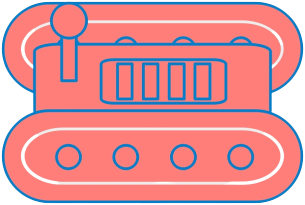

<!DOCTYPE html>
<html>
<head>
	<meta charset="utf-8" />
	<title>ROBOT TRANSPORTEUR</title>
	<link rel="stylesheet" type="text/css" href="CSS/style.css">
    <link rel="shortcut icon" href="images/Logo__2_-removebg-preview.png" type="image/png">
</head>
<body>
	<header>
		<h1>ROBOT TRANSPORTEUR</h1>
		
	</header>
	<main>
        <nav class="menu">
            <lu class = tâches>
                <li id = "commande">
                    <a href="Commande.html" class = "commandeIcon">commande</a>
                </li>
                <li id = "Localisation">
                    <a href="Localisation.html" class = "LocalisationIcon">Localisation</a>
                </li>
            </lu>
       </nav>
		<!-- c  -->
        

            

              <!--  

                    <label for="element" id = "CommandLable">Commande : </label>
                    <input type="text" id="element" name="element">
                
-->
                <form id = "elements">
                    <label for="element">Commande : </label>
                    <input type="text" id="element" name="element">
                </form>
                

                    <label for="status" id = "etat"><h2>ROBOT</h2></label>
                

            

            

                

                    <label for="zone"><h2>Zone départ</h2></label>
                    <form action="/action_page.php" method="get"></form>
                        <select id="depart" name="depart">
                            <option value="zone1">Zone 1</option>
                            <option value="zone2">Zone 2</option>
                            <option value="zone3">Zone 3</option>
                        </select>
                    </form>
                

                

                    <label for="zone"><h2>Zone d'arriver</h2></label>
                    <form action="/action_page.php" method="get"></form>
                        <select id="arriver" name="arrive">
                            <option value="zone1">Zone 1</option>
                            <option value="zone2">Zone 2</option>
                            <option value="zone3">Zone 3</option>
                        </select>
                    </form>
                

            

            <button type="button" id="Valdier" onclick="recupererTexte(), recupererzonearrive(), recupererzonedepart()">Valider</button>
        

	</main>
    

	<footer>
        <h1 class="Team">TEAM</h1>
            
 ZERYOUHI Amine,
                ZERYOUHI Amine, 
                ZERYOUHI Amine

            

            <h2>VERSION 0.1 </h2>
		<!-- contenu du pied de page -->
	</footer>

    

</body>
</html>

<!DOCTYPE html>
<html>
<head>
	<meta charset="utf-8" />
	<title>ROBOT TRANSPORTEUR</title>
	<link rel="stylesheet" type="text/css" href="CSS/style.css">
    <link rel="shortcut icon" href="images/Logo__2_-removebg-preview.png" type="image/png">
</head>
<body>
	<header>
		<h1>ROBOT TRANSPORTEUR</h1>
		
	</header>
	<main>
        <nav class="menu">
            <lu class = tâches>
                <li id = "commande">
                    <a href="Commande.html" class = "commandeIcon">commande</a>
                </li>
                <li id = "Localisation">
                    <a href="Localisation.html" class = "LocalisationIcon">Localisation</a>
                </li>
            </lu>
       </nav>
		<!-- c  -->
        
	</main>
    

	<footer>
        <h1 class="Team">TEAM</h1>
            
 ZERYOUHI Amine,
                ZERYOUHI Amine, 
                ZERYOUHI Amine

            

            <h2>VERSION 0.1 </h2>
		<!-- contenu du pied de page -->
	</footer>

</body>
</html>

